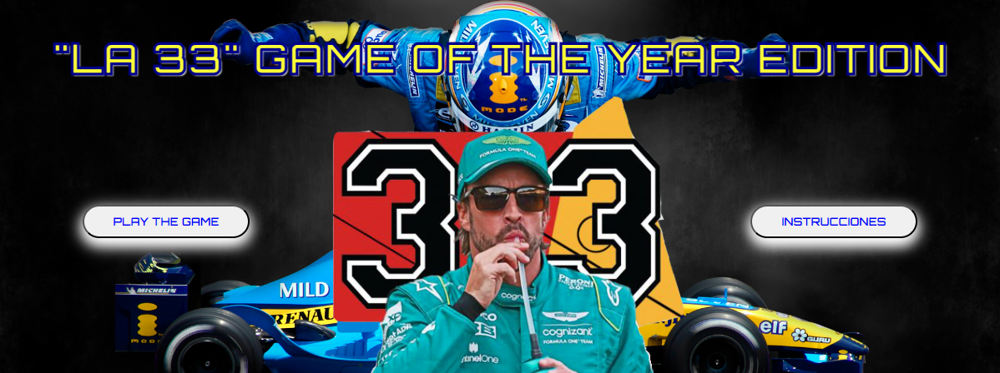

# "LA 33": GAME OF THE YEAR EDITION

## [Play the Game!](https://sergiopyd.github.io/Proyecto1-la-33-alonso-game/)

# Description

Juego de carreras en el que a mandos del coche de Fernando Alonso, intentaremos conseguir el objetivo de ganar la carrera número 33 en la historia de nuestro protagonista. Revive las batallas más épicas de Alonso enfrentandote a enemigos como Michael Schumacher, Lewis Hamilton o el más reciente Max Verstappen. Juego con diferentes stages de dificultad a medida que avance el juego y powerUps diferentes que te ayudarán en carrera. Desbloquea el modo "Hardcore" una vez consigas ganar el juego para ponerte a prueba a ver cuántas carreras consigues en la máxima dificultad sin powerUps.

# Main Functionalities

- El movimiento del coche funciona con las teclas `arriba`, `abajo`, `izquierda` y `derecha` de nuestro teclado.
- Los enemigos aparecen de derecha a izquierda aleatoriamente y nuestro objetivo es esquivarlos.
- A medida que avanzamos, aumentaremos el contador de carreras ganadas. Cuando avancemos en carreras, el stage cambiará a la vez que la dificultad del juego.
- Tenemos 3 stages de dificultad. En cada stage, nuestro coche se actualizará (sin presentar mejoras) a la vez que el de los enemigos (estos sí que aumentaran la velocidad en la que recorren el campo de juego). Stage 1 :Vuelta 0-14. Stage 2 :Vuelta 14-24. Stage 3 :Vuelta 24-33.
- Comienzas con 3 vidas para completar el juego. Si colisionas con un enemigo pierdes una vida. Cuando te quedes a 0, aparece automáticamente la pantalla de "Game Over".
- En pantalla tendremos un contador de carreras ganadas que se van sumando cuando la linea de carrera desaparece del mapa. A parte, un contador de las vidas que tenemos que se va actualizando cuando perdemos una vida o la ganamos mediante un powerUp. Por ultimo, un mensaje del stage en el que nos encontramos.
- Existen 2 mejoras que aparecen aleatoriamente por el campo de juego y desaparecen a los 3 segundos si no los tocas con tu coche:
    -Mejora de vida: Este powerUp con forma de corazon suma una vida adicional a tu contador de vidas.
    -Mejora de velocidad: Con forma del entrañable erizo "Sonic", hará que tus desplazamientos por el campo de juego sean más rápidos. Este efecto dura solo 3 segundos, pero no te preocupes que tendrás un contador en pantalla que te indica los segundos restantes de la mejora.
- Cuando ganas el juego, se desbloquea un nuevo modo de juego llamado "Hardcore" en el que podrás a prueba tu coche. En este modo, aparecen más enemigos scretos, no tienes powerUps que te ayudarán y la velocidad de los enemigos es similar al Stage 3 del juego principal. Ponte a prueba a ver hasta donde llegas.
- El juego presenta diferentes elementos decorativos que tienen su propio movimiento para dar efecto de velocidad al campo de juego. A parte, nos mostrará en el campo visual el momento de empezar la carrera y la linea de meta cuando lleguemos a la carrera 33.
- El juego dispone de diferentes pantallas y menús para poder interactuar entre ellas.
    -Pantalla inicial: Con botones de "Start Game" e instrucciones.
    -Instrucciones: Muestra los conceptos básicos del juego.
    -Win Screen: Aparece cuando consigues ganar 33 carreras desbloqueando la opción "modo hardcore".
    -Game Over Screen: Cuando pierdes todas las vidas, automáticamente se muestra esta pantalla. Esta pantalla de Game Over cambia cuando estás jugando en modo hardcore y desbloquea hasta 18 imágenes distintas que se mostraran en pantalla de manera aleatoria.
- Cada pantalla dispone de música de fondo y el juego también presenta efectos de sonido para cada momento de la partida:
    -Musica de fondo para cada pantalla:
    -Sonidos cuando chocas con rivales y coges los diferentes powerUps.

# Backlog Functionalities

- Mejora en la fluidez del movimiento del coche principal, enemigos y línea de meta.
- Mejora visual del campo de juego a medida que avanzas en stages.
- Adaptación de la jugabilidad para que sea compatible para smartphone.
- Optimización de los elementos random que aparecen a lo largo de la partida.
- Agrupar todos los elementos visuales en una sola clase.

# Technologies used

- HTML
- CSS
- JavaScript
- DOM Manipulation
- JS Classes
- Local Storage
- JS Audio()
- Adobe Photoshop

# States

- Pantalla de inicio.
- Pantalla de instrucciones.
- Pantalla del juego.
- Pantalla para cuando ganas.
- Dos diferentes pantallas de Game Over en función al juego.

# Proyect Structure

## main.js
-startGame()
-instructions()
-instruccionesToInicio()
-gameOvertoTryAgain()
-gameOverHardcoretoTryAgain()
-gameOverToInicio()
-gameOverHarcoreToInicio()
-winToInicio()
-winToHardcore()

## Game.js

- Game (stageOne) 
    -this.stageOne;
    -this.alonso;
    -this.enemyArr;
    -this.powerUppArr;
    -this.redLineArr;
    -this.whiteLineArr;
    -this.raceLineArr;
    -this.lvlUpArr;
    -this.speedArr;
    -this.isGameOn;
    -this.lvlUpShow;
    -this.moreSpeed;
    -this.moreSpeedShow; 
    -this.speedCounter;
    -this.speedTime;
    -this.itemDisapearTime;
    -this.frames;
    -this.counter; 
    -this.vida;
    -this.collitionSound; 
    -this.lifeUpSound;
    -this.speedSound;
    -this.onvniSound;  
-vidasLayout()
-win()
-gameOver()
-alonsoUpdate()
-randomItemLvlUp()
-lvlUpCollition()
-randomItemLvlUpDesaparece()
-randomItemSpeed()
-randomItemSpeedUpDesaparece()
-SpeedCollition()
-speedCountDown()
-rivalesAparecen()
-rivalesDesaparecen()
-rivalCollition()
-sonidoColision()
-redLineAparecen()
-redLineDesaparecen()
-whiteLineAparecen()
-whiteLineDesaparecen()
-raceLineAparecen()
-raceLineDesaparecen()
-stageOnWeb()
-gameLoop()

## alonsoCar.js 

- Alonso () {
    -this.carNode
    -this.velocidadAlonso
    -this.x
    -this.y
    -this.w
    -this.h
    -this.carNode.style.width
    -this.carNode.style.height
    -this.carNode.style.position
    -this.carNode.style.top
    -this.carNode.style.left
    -this.carNode.style.zIndex
  }
- movimientoContinuo () {}
- actualizacionPosicion () {}

## rivales.js
- rivales (posY,cocheArriba, speed) {
    -this.rivalNode
    -this.x
    -this.y
    -this.w
    -this.h
    -this.rivalNode.style.width
    -this.rivalNode.style.height
    -this.rivalNode.style.position
    -this.rivalNode.style.top
    -this.rivalNode.style.left
    -this.rivalNode.style.zIndex
  }
- automaticMovement () {}
- positionUpdate () {}

## race-line.js,red-line.js,white-line.js

- RaceLine () {
    -this.raceLineNode
    -this.x
    -this.y
    -this.w
    -this.h
    -this.raceLineNode.style.width
    -this.raceLineNode.style.height
    -this.raceLineNode.style.position
    -this.raceLineNode.style.top
    -this.raceLineNode.style.left
    -this.raceLineNode.style.zIndex
  }
- automaticMovement () {}
- positionUpdate () {}

## itemLvlUp.js,itemSpeed.js

- RaceLine () {
    -this.itemSpeedNode
    -this.x
    -this.y
    -this.w
    -this.h
    -this.itemSpeedNode.style.width
    -this.itemSpeedNode.style.height
    -this.itemSpeedNode.style.position
    -this.itemSpeedNode.style.top
    -this.itemSpeedNode.style.left
    -this.itemSpeedNode.style.zIndex
  }

# Extra Links 

### Sketch
[Link](https://www.canva.com/design/DAFpQJVoXfA/D-OsxwojUzSBMONwJcQ7zw/view?utm_content=DAFpQJVoXfA&utm_campaign=designshare&utm_medium=link&utm_source=publishsharelink)

### Trello
[Link](www.https://trello.com/invite/b/Nks6SdRv/ATTI8ac37402b537e718986a030e517938d5A9C61F8C/la-33-trello-url-here.com)

### Slides
[Link](www.your-slides-url-here.com)

## Deploy
[Link](www.your-deploy-url-here.com)